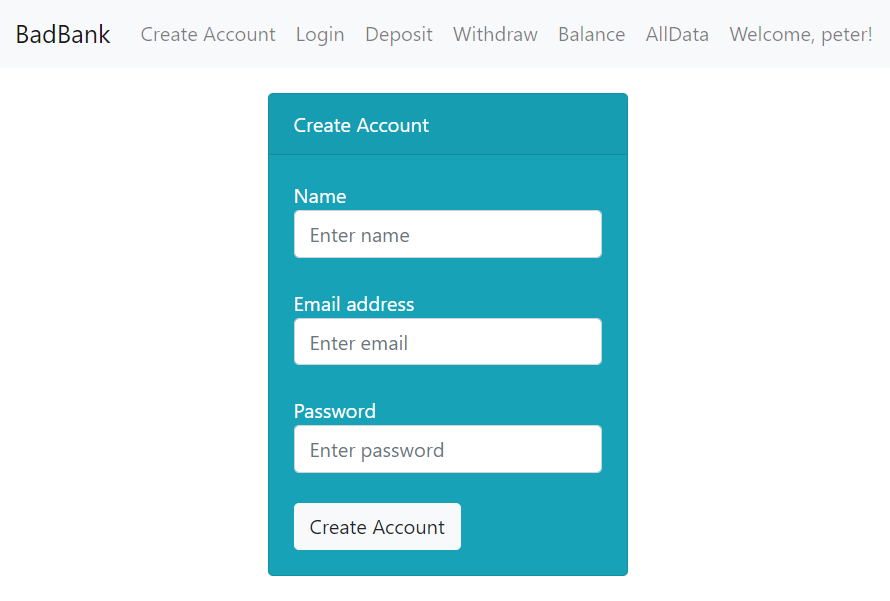

# Bad-Bank2
## Bad Bank 2 Project, A Follow Up to Bad Bank
<b>Screenshot</b>   
<b>Description/Motivation</b> Bad-Bank2 is a follow up to the Bad-Bank application in this Github. It is so named because it does not have security (no login or logout). The next iteration will shortly, as this is my Capstone project for MIT xPro Bootcamp. This project displays my capabilities in building a full stack project, utilizing Bootstrap, React, Express/Node, MongoDB, and Docker.  

<b>Installation Guidelines</b> 
Take the following steps to install dependencies and to run this project on your machine. This project was created on a machine with Node.js v18.17.0 installed. 
1. Clone the files to your machine. 
2. Open a terminal and type and enter the following commands:
3. npm init -y
4. npm install express
5. npm install cors
6. Run Docker by typing and entering docker run -p 27017:27017 --name badbank -d mongo
7. Run npm install mongodb
8. Sensitive Firebase configuration keys need to be added to the firebaseConfig variable. Get that data from creating an authentication app in the firebase console and enter the data into the variable in the login.js file.
9. Get a service account key json file and add the file to your directory.
10. Make sure Docker is running and that a connection to http://localhost:27017 is running on MongoDB Compass or the code will not work. Then run node index.js and navigate to http://localhost:3000.  

<b>Technology Used</b> 
Javascript CSS Bootstrap React Express/Node MongoDB Compass Docker  

<b>Features</b> 
The BadBank2 project contains a page with an input field whereby someone can enter a name, email, and password. There is a deposit page and a withdraw page as well, with balance that is updated as amounts are entered. A list of all user information is displayed on the All Data page. Additional functionality that would be helpful to a user for future iterations would be to include secure login and log out. This will be included soon.  

<b>MIT License</b>

Copyright (c) 2023 Yvette Watson

Permission is hereby granted, free of charge, to any person obtaining a copy of this software and associated documentation files (the "Software"), to deal in the Software without restriction, including without limitation the rights to use, copy, modify, merge, publish, distribute, sublicense, and/or sell copies of the Software, and to permit persons to whom the Software is furnished to do so, subject to the following conditions: The above copyright notice and this permission notice shall be included in all copies or substantial portions of the Software.

THE SOFTWARE IS PROVIDED "AS IS", WITHOUT WARRANTY OF ANY KIND, EXPRESS OR IMPLIED, INCLUDING BUT NOT LIMITED TO THE WARRANTIES OF MERCHANTABILITY, FITNESS FOR A PARTICULAR PURPOSE AND NONINFRINGEMENT. IN NO EVENT SHALL THE AUTHORS OR COPYRIGHT HOLDERS BE LIABLE FOR ANY CLAIM, DAMAGES OR OTHER LIABILITY, WHETHER IN AN ACTION OF CONTRACT, TORT OR OTHERWISE, ARISING FROM, OUT OF OR IN CONNECTION WITH THE SOFTWARE OR THE USE OR OTHER DEALINGS IN THE SOFTWARE.
